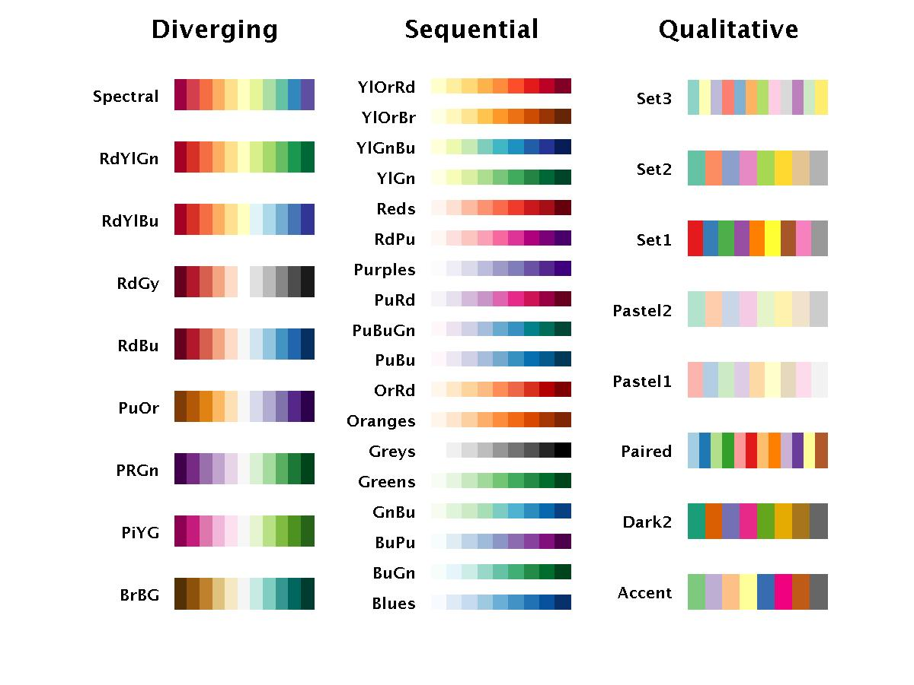

```{r}
knitr::opts_chunk$set(fig.height=4, 
                      cache = TRUE)
```

# Why? 

## Figures in R? 

- Keep analysis and figures together
- Versatile

## Figures with ggplot?

> - Very powerful
> - Same "grammar" for many different kinds of plots
> - Polished graphs (publications, presentations, reports)
> - Many users = easy to get help

# What?

## 

- **Ask questions. Anytime. Really!**
- Work with your buddy

##

- This is an intermediate workshop
- Assumes working knowledge of R
- Relatively fast-paced

<!-- ## Goal -->

# How?

## 

1. Explain the basics components
2. Build knowledge through **examples**

## TODAY

> - We'll learn to plot distributions of one variables (barplots, histograms, density)
> - We'll learn to facet plots
> - We'll learn to work with continuous and discrete scales (colors, fills, position)
> - We'll learn to add labels to our plots (for papers or publications)

## NEXT TIME

If there is interest:

> - We'll learn to plot two variables (boxplots and scatterplots)
> - We'll learn to zoom in graphs 
> - We'll learn to customize the looks of the plot (theme)
> - We'll learn the best ways to save plots so they can be inserted in reports

## 

Even more interest:

> - Lines, polygons, basic maps and big data
> - Customize legends
> - Put multiple plots together for a paper (a, b, c)

# The grammar of graphics

##

The idea behind a "grammar" for doing graphs is that **Every plot can be built with the same components** 

##


## 

We need to specify at least:

> - The **data**
> - A mapping of **aes**thetics that translates data to visual variables (position, color, size, ...)
> - A **geom**etry that describes the visual marks used to represent the data (points, lines, bars, ...)

## How it looks like

```{r eval=FALSE}
ggplot(data = <MY DATA>) +
  <GEOM_FUNCTION>(mapping = aes(<MAPPINGS>))
```

Have a look at your cheatsheet!

# Bar charts

## The diamonds data set

```{r, echo=FALSE, message=FALSE, warning=FALSE}
library(tidyverse)
```

```{r}
library(tidyverse)
diamonds
```

## Our first plot

```{r, echo = FALSE}
ggplot(data = diamonds) +
  geom_bar(mapping = aes(x = cut, fill = clarity), position = "dodge")
```

##

```{r}
ggplot(data = diamonds)
```

##

```{r}
ggplot(data = diamonds, 
       mapping = aes(x = cut))
```

##

```{r, eval = T}
ggplot(data = diamonds, 
       mapping = aes(x = cut)) +
  geom_bar()
```

## 

<div class="container">
<div class="col">
```{r, fig.width=5, fig.height=5}
ggplot(data = diamonds, 
       mapping = aes(x = cut)) +
  geom_bar()
```
</div>
<div class="col">
```{r, fig.width=5, fig.height=5}
## mappings can go on each geom
ggplot(data = diamonds) +
  geom_bar(mapping = aes(x = cut))
```
</div>
</div>

## 

give it a try yourself!

```{r, echo = FALSE}
ggplot(data = diamonds) +
  geom_bar(mapping = aes(x = cut, fill = cut))
```

##

```{r}
ggplot(data = diamonds) +
  geom_bar(mapping = aes(x = cut, colour = cut))
```

##

```{r, echo = TRUE}
ggplot(data = diamonds) +
  geom_bar(mapping = aes(x = cut, fill = cut))
```

##

Remember the plot we're trying to do:

```{r, echo = FALSE}
ggplot(data = diamonds) +
  geom_bar(mapping = aes(x = cut, fill = clarity), position = "dodge")
```

## 

**position adjustments** 

```{r}
ggplot(data = diamonds) +
  geom_bar(mapping = aes(x = cut, fill = clarity), 
           position = "stack")
```

##

```{r}
ggplot(data = diamonds) +
  geom_bar(mapping = aes(x = cut, fill = clarity), 
           position = "fill")
```

##

```{r}
ggplot(data = diamonds) +
  geom_bar(mapping = aes(x = cut, fill = clarity), 
           position = "identity") # no ajdustment
```

##

```{r}
ggplot(data = diamonds) +
  geom_bar(mapping = aes(x = cut, fill = clarity), 
           position = "dodge") 
```

##

Yay!


##

Let's have a look at facets now


## Facets

Facets divide a plot into subplots based on the values of one or more discrete variables

```{r, eval = FALSE}
ggplot(data = <MY DATA>) +
  <GEOM_FUNCTION>(mapping = aes(<MAPPINGS>)) +
  <FACET_FUNCTION>(<VARIABLES>)
```

## Two faceting functions

> - `facet_grid()`
> - `facet_wrap()`

Have a look at your cheat-sheet to see how they work!

## Our second plot

```{r, echo = FALSE}
ggplot(data = diamonds) +
  geom_bar(mapping = aes(x = color, fill = cut)) +
  facet_wrap(vars(cut))
```

## 

Let's start with `facet_grid()`

It requires **columns** and/or **rows**

##

```{r}
ggplot(data = diamonds) +
  geom_bar(mapping = aes(x = color, fill = cut)) +
  facet_grid(cols = vars(cut))
```

##

```{r}
ggplot(data = diamonds) +
  geom_bar(mapping = aes(x = color, fill = cut)) +
  facet_grid(rows = vars(cut))
```

##

```{r}
ggplot(data = diamonds) +
  geom_bar(mapping = aes(x = color, fill = cut)) +
  facet_grid(cols = vars(cut), rows = vars(clarity))
```

## 

Our target plot requires `facet_grid()`

Give it a try yourself. 

```{r, echo = FALSE}
ggplot(data = diamonds) +
  geom_bar(mapping = aes(x = color, fill = cut)) +
  facet_wrap(vars(cut))
```

##

Yay!


## The pressure dataset

```{r}
pressure
```

## Our third plot

```{r, echo = FALSE}
ggplot(data = pressure) +
  geom_col(mapping = aes(x = temperature, y = pressure, fill = pressure)) +
  labs(#title = "Vapor pressure of mercury ", 
       # subtitle = "Data for 19 temperatures", 
       caption = "Source: Weast (1973)", 
       x = "Temperature (ºC)", 
       y = "Pressure (mm of Hg)", 
       tag = "(a)", 
       fill = "Pressure") 

```

## 

This doesn't work...

```{r, error = TRUE, fig.keep='none'}
ggplot(data = pressure) +
  geom_bar(mapping = aes(x = temperature, 
                         y = pressure, 
                         fill = pressure))
```

**Why?**

## 

```{r}
ggplot(data = pressure) +
  geom_col(mapping = aes(x = temperature, 
                         y = pressure, 
                         fill = pressure))
```

##

```{r, echo = FALSE}
ggplot(data = pressure) +
  geom_col(mapping = aes(x = temperature, y = pressure, fill = pressure)) +
  labs(#title = "Vapor pressure of mercury ", 
       # subtitle = "Data for 19 temperatures", 
       caption = "Source: Weast (1973)", 
       x = "Temperature (ºC)", 
       y = "Pressure (mm of Hg)", 
       tag = "(a)", 
       fill = "Pressure") 

```

## Labels

Critical for making plots accessible and publication ready

## 

A labelled empty plot

<div class="container">
<div class="col">
```{r, eval = F, fig.width=5, fig.height=5}
ggplot() +
  labs(title = "The title", 
       subtitle = "The subtitle", 
       caption = "The caption", 
       x = "The x axis", 
       y = "The y axis", 
       tag = "TAG")
```
</div>
<div class="col">
```{r, echo = F, fig.width=5, fig.height=5}
ggplot() +
  labs(title = "The title", 
       subtitle = "The subtitle", 
       caption = "The caption", 
       x = "The x axis", 
       y = "The y axis", 
       tag = "TAG")
```
</div>
</div>

## LABELS

> - **title** & **subtitle**: explain main findings (presentations!)
> - **caption**: extra info, usually source
> - **tag**: identify between multiple plots
> - **aesthetics**: title for `x`, `y`, `fill`, or any other aesthetic

##

```{r, echo = FALSE}
ggplot(data = pressure) +
  geom_col(mapping = aes(x = temperature, y = pressure, fill = pressure)) +
  labs(caption = "Source: Weast (1973)", 
       x = "Temperature (ºC)", 
       y = "Pressure (mm of Hg)", 
       tag = "(a)", 
       fill = "Pressure") 
```

##

```{r, echo = TRUE}
ggplot(data = pressure) +
  geom_col(mapping = aes(x = temperature, y = pressure, fill = pressure)) +
  labs(caption = "Source: Weast (1973)", 
       x = "Temperature (ºC)", 
       y = "Pressure (mm of Hg)", 
       tag = "(a)", 
       fill = "Pressure") 

```

## 

```{r, echo = FALSE, fig.height=6}
ggplot(data = pressure) +
  geom_col(mapping = aes(x = temperature, y = pressure, fill = pressure)) +
  labs(title = "Pressure raises exponentially with temperature", 
       subtitle = "Vapor pressure of mercury for 19 temperatures", 
       caption = "Source: Weast (1973)", 
       x = "Temperature (ºC)", 
       y = "Pressure (mm of Hg)",
       fill = "Pressure") +
  theme(plot.title =  element_text(size = 20, face = "bold"), 
        plot.subtitle = element_text(margin = margin(b = 20)))

```

## 

Yay!


# Histograms

## {data-background-iframe="https://player.vimeo.com/video/221607341"}

## Our fourth plot

```{r, echo= FALSE}
ggplot(data = diamonds) +
  geom_histogram(aes(x = price), 
                 binwidth = 1000,
                 colour = "black", position = "stack",boundary = 0, 
                 fill = "white")
```

##

We're gonna use `geom_histogram()` and 

Check your cheatsheet!

## 

```{r}
ggplot(data = diamonds) +
  geom_histogram(aes(x = price))
```

## 

```{r}
ggplot(data = diamonds) +
  geom_histogram(mapping = aes(x = price), binwidth = 10)
```

## 

```{r}
ggplot(data = diamonds) +
  geom_histogram(mapping = aes(x = price), binwidth = 10000)
```

## 

```{r}
ggplot(data = diamonds) +
  geom_histogram(mapping = aes(x = price), binwidth = 1000)
```

## 

```{r}
ggplot(data = diamonds) +
  geom_histogram(mapping = aes(x = price), binwidth = 1000, boundary = 0)
```

##

When aesthetics do not depend on data they are placed **outside** the mapping argument. 

## 

<div class="container">
<div class="col">
```{r, fig.width=5, fig.height=5, warning=FALSE, message=FALSE}
ggplot(data = diamonds) +
  geom_histogram(aes(x = price, 
                     color = "black"))
```
</div>
<div class="col">
```{r, fig.width=5, fig.height=5, warning=FALSE, message=FALSE}
ggplot(data = diamonds) +
  geom_histogram(aes(x = price), 
                 color = "black")
```
</div>
</div>

##

```{r}
ggplot(data = diamonds) +
  geom_histogram(aes(x = price), binwidth = 1000, boundary = 0, 
                 color = "black", fill = "white")
```

## Our fifth plot

```{r, echo= FALSE}
ggplot(data = diamonds) +
  geom_density(aes(x = price, fill = cut), 
                 colour = "black", position = "stack") +
  scale_fill_brewer(palette = "Greens", direction = -1)
```

##

We can use `geom_density()` as an alternative to `geom_histogram()`

<div class="container">
<div class="col">
```{r, fig.width=5, fig.height=5, warning=FALSE, message=FALSE}
ggplot(data = diamonds) +
  geom_histogram(aes(x = price))
```
</div>
<div class="col">
```{r, fig.width=5, fig.height=5, warning=FALSE, message=FALSE}
ggplot(data = diamonds) +
  geom_density(aes(x = price))
```
</div>
</div>

## 

**fill** by *cut*

```{r}
ggplot(data = diamonds) +
  geom_density(aes(x = price, fill = cut))
```

But it has the wrong positioning...

## 

We can see them better using `position = "stack"`

```{r}
ggplot(data = diamonds) +
  geom_density(aes(x = price, fill = cut), 
                 position = "stack") 
```

## PLOTS ARE OBJECTS TOO

We can save plots assigning them to a variable in R

```{r}
plot4 <- ggplot(data = diamonds) +
  geom_density(aes(x = price, fill = cut), 
                 position = "stack") 
```

## 

We can then render them and add on stuff by calling the variable

```{r}
plot4
```


## SCALES

> - **scales** map values in the data space to values in the aesthetic space (color, fill, size, position, shape ...)
> - You can see scales in the **axes** or the **legends**
> - Basically scales, determine how the geom looks

##

How many **scales** you see in this plot? What are they?

```{r, echo= FALSE}
ggplot(data = diamonds) +
  geom_density(aes(x = price, fill = cut), 
                 colour = "black", position = "stack") +
  scale_fill_brewer(palette = "Greens", direction = -1)
```

##

```{r, echo= FALSE}
ggplot(data = diamonds) +
  geom_density(aes(x = price, fill = cut), 
                 colour = "black", position = "stack") +
  scale_fill_brewer(palette = "Greens", direction = -1)
```

> - 1 linear continuous for **position x**
> - 1 linear continuous for **position y**
> - 1 discrete for **fill**

##

```{r echo = FALSE}
ggplot(data = pressure) +
  geom_col(mapping = aes(x = temperature, 
                         y = pressure, 
                         fill = pressure))
```

- 1 linear continuous for **position x**, 
- 1 linear continuous for **position y**, 
- 1 linear continuous for **fill**

## 

```{r, echo = FALSE}
ggplot(data = diamonds) +
  geom_bar(mapping = aes(x = cut, fill = clarity), position = "dodge")
```

- 1 discrete for **position x**
- 1 linear continuous for **position y**
- 1 discrete for **fill**

##

To change the filling colors we need to change the **discrete** scale for **fill**

```{r, echo= FALSE}
ggplot(data = diamonds) +
  geom_density(aes(x = price, fill = cut), 
                 colour = "black", position = "stack") +
  scale_fill_brewer(palette = "Greens", direction = -1)
```

## DISCRETE FILL SCALES

In `ggplot` we have multiple options for discrete scales of fill (or colour)

##

`scale_fill_viridis_d()` The default - based on the viridis scales

Viridis scales are good: colourblind safe, perceptually uniform, look OK in black and white


##

`scale_fill_viridis_d()` The default - based on the viridis scales

```{r}
ggplot(data = diamonds) +
  geom_density(aes(x = price, fill = cut), 
                 position = "stack")  + 
  scale_fill_viridis_d()
```

## 

remember plots are objects too so we can add layers 

<div class="container">
<div class="col">
```{r, fig.height=3, fig.width=5}
ggplot(data = diamonds) +
  geom_density(aes(x = price, fill = cut), 
                 position = "stack")  + 
  scale_fill_viridis_d()
```
</div>
<div class="col">
```{r, fig.height=3, fig.width=5}
plot4 <- ggplot(data = diamonds) +
  geom_density(aes(x = price, fill = cut), 
                 position = "stack")
plot4 + scale_fill_viridis_d()
```
</div>
</div>

## 

`scale_fill_viridis_d()` has five options. The default is "D"

<div class="container">
<div class="col">
```{r, fig.height=4, fig.width=5}
plot4 + 
  scale_fill_viridis_d(option = "A")
```
</div>
<div class="col">
```{r, fig.height=4, fig.width=5}
plot4 + 
  scale_fill_viridis_d(option = "E")
```
</div>
</div>

##

`scale_fill_hue()` used to be the default 

Maps each level to an evenly spaced hue on the colour wheel. It does not generate colour-blind safe palettes.

##

```{r}
plot4 + 
  scale_fill_hue()
```


##

`scale_fill_brewer()` Is another good one - based on ColorBrewer

Originally designed for cartography, but look awesome in all kinds of plots

##



##

<div class="container">
<div class="col">
```{r, fig.height=4, fig.width=5}
plot4 + 
  scale_fill_brewer(palette = "Purples")
```
</div>
<div class="col">
```{r, fig.height=4, fig.width=5}
plot4 + 
  scale_fill_brewer(palette = "YlGn")
```
</div>
</div>

##

Our fifth plot uses the "Greens" palette of color brewer... Try it yourself

## 

What happens if you add the argument `direction = -1` inside `scale_fill_brewer()`?

```{r, echo= FALSE}
plot4 +
  scale_fill_brewer(palette = "Greens", direction = -1)
```

## BONUS SCALE

`scale_fill_manual()` can be used to define your very own colour pallete

##

```{r}
really_ugly_colors <- c("yellow", "blue", "red", "white", "green")
plot4 + scale_fill_manual(values = really_ugly_colors)
```

## 

Yay!


## BONUS PLOT: Our sixth plot

```{r, echo = FALSE, message=FALSE, warning=FALSE}
cut_values <- c("Worst", "Bad", "Average", "Good", "Best")
library(scales)
ggplot(data = diamonds) +
  geom_bar(mapping = aes(x = cut, fill = cut)) +
  scale_fill_brewer(palette = "Reds", 
                    name = NULL,
                    labels = cut_values) +
  scale_x_discrete(labels = cut_values, name = "Cut") +
  scale_y_continuous(labels = unit_format(scale = 1/1000, unit = ""), breaks = seq(0, 100000, by = 2000), name = "Count (thousands)")
```

##

```{r}
ggplot(data = diamonds) +
  geom_bar(mapping = aes(x = cut, fill = cut)) +
  scale_fill_brewer(palette = "Reds")
```

## 

Remember: **scales** map values in the data space to values in the aesthetic space (color, fill, size, position, shape ...)

So, scales also help us define breaks and labels

##

```{r}
ggplot(data = diamonds) +
  geom_bar(mapping = aes(x = cut, fill = cut)) +
  scale_fill_brewer(palette = "Reds") +
  scale_y_continuous(breaks = c(1000, 10000, 20000))
```

##

```{r}
ggplot(data = diamonds) +
  geom_bar(mapping = aes(x = cut, fill = cut)) +
  scale_fill_brewer(palette = "Reds") +
  scale_y_continuous(breaks = c(1000, 10000, 20000), 
                     labels = c("one thousand", "ten thousand", "twenty thousand"))
```

##

```{r}
ggplot(data = diamonds) +
  geom_bar(mapping = aes(x = cut, fill = cut)) +
  scale_fill_brewer(palette = "Reds") +
  scale_y_continuous(breaks = seq(0, 30000, by = 2000))
```

## 

If I want to change the labels by hand, and there are lots of labels it can be a pain in the ass

We will use the `scales` package

```{r, message=FALSE, warning=FALSE}
library(scales)
```

> - percentages
> - scientific
> - units
> - dates
> - dollar, ...

##

```{r}
ggplot(data = diamonds) +
  geom_bar(mapping = aes(x = cut, fill = cut)) +
  scale_fill_brewer(palette = "Reds") +
  scale_y_continuous(breaks = seq(0, 30000, by = 2000), 
                     labels = unit_format(scale = 1/1000, unit = "thousand"))
```

##

```{r}
ggplot(data = diamonds) +
  geom_bar(mapping = aes(x = cut, fill = cut)) +
  scale_fill_brewer(palette = "Reds") +
  scale_y_continuous(breaks = seq(0, 30000, by = 2000), 
                     labels = unit_format(scale = 1/1000, unit = ""))
```

## 

Now let's do different labels for the **fill** scale and the **x** discrete scale

```{r}
cut_values <- c("Worst", "Bad", "Average", "Good", "Best")
```

##

```{r}
ggplot(data = diamonds) +
  geom_bar(mapping = aes(x = cut, fill = cut)) +
  scale_fill_brewer(palette = "Reds", 
                    labels = cut_values) +
  scale_x_discrete(labels = cut_values) +
  scale_y_continuous(labels = unit_format(scale = 1/1000, unit = ""), 
                     breaks = seq(0, 30000, by = 2000))
```

## 

Now we just need to change the names of the scales

We did that before using `labs()`. But we can also do it within the scales as well

##

```{r}
ggplot(data = diamonds) +
  geom_bar(mapping = aes(x = cut, fill = cut)) +
  scale_fill_brewer(palette = "Reds", 
                    labels = cut_values, 
                    name = NULL) +
  scale_x_discrete(labels = cut_values, name = "Cut") +
  scale_y_continuous(labels = unit_format(scale = 1/1000, unit = ""), 
                     breaks = seq(0, 30000, by = 2000), 
                     name = "Count (thousands)")
```

##

Yay!


## NEXT TIME

If there is interest:

> - We'll learn to plot two variables (boxplots and scatterplots)
> - We'll learn to zoom in graphs 
> - We'll learn to customize the looks of the plot (theme)
> - We'll learn to use logarithmic scales
> - We'll learn the best ways to save plots so they can be inserted in reports

## 

Or... check out this excellent online tutorial https://rstudio.cloud/learn/primers/3
